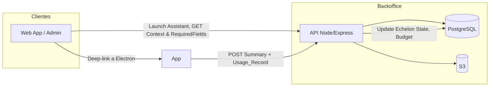
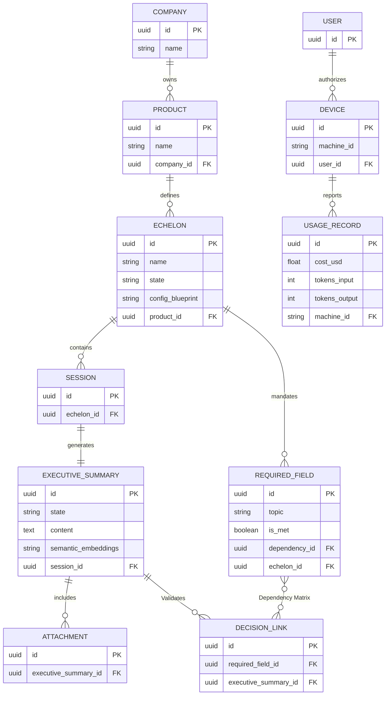
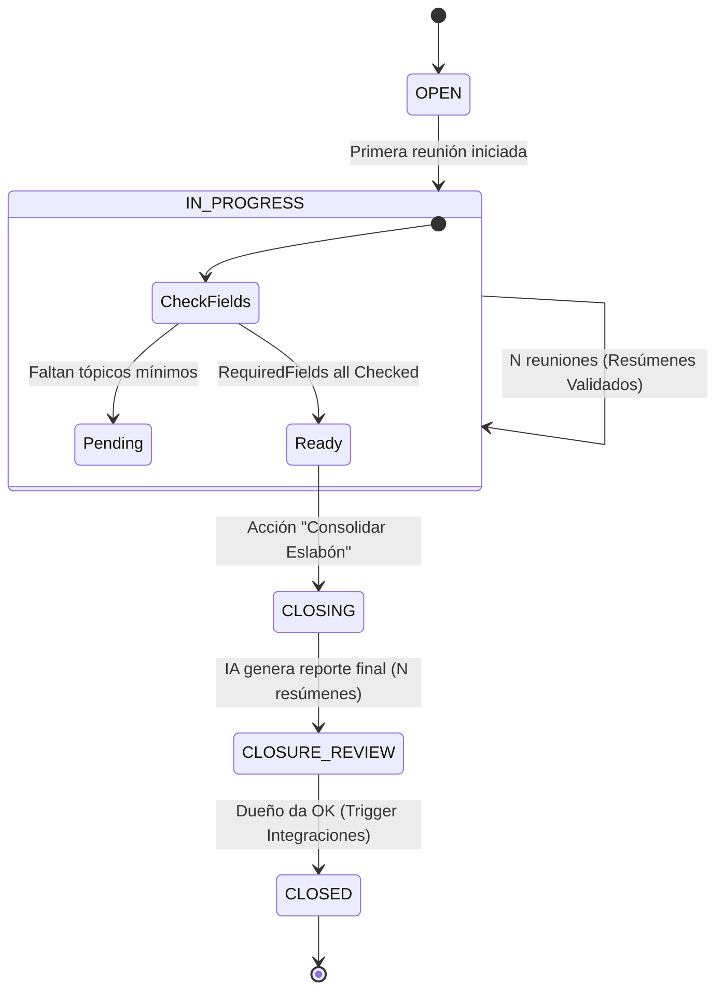
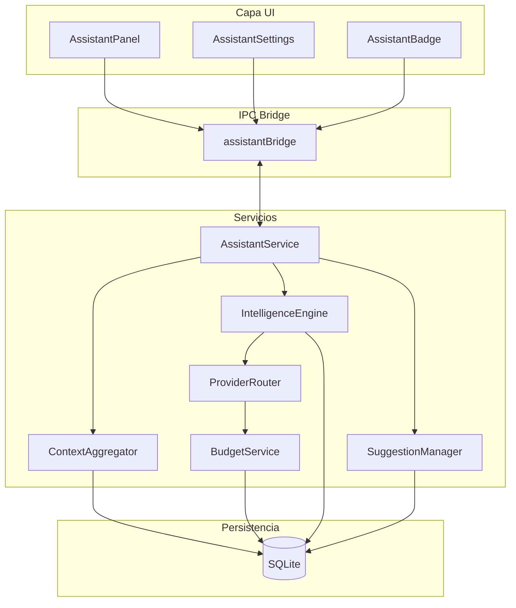
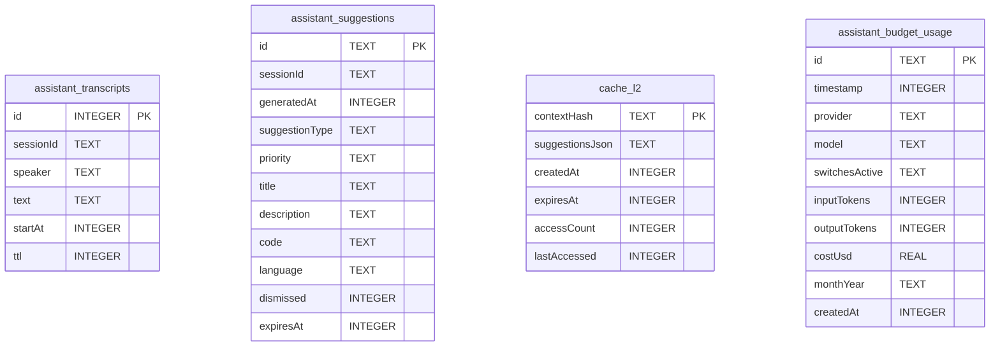
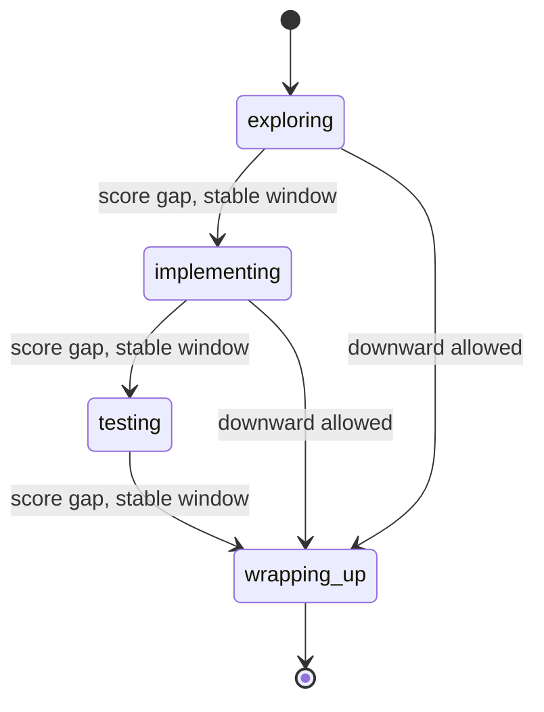
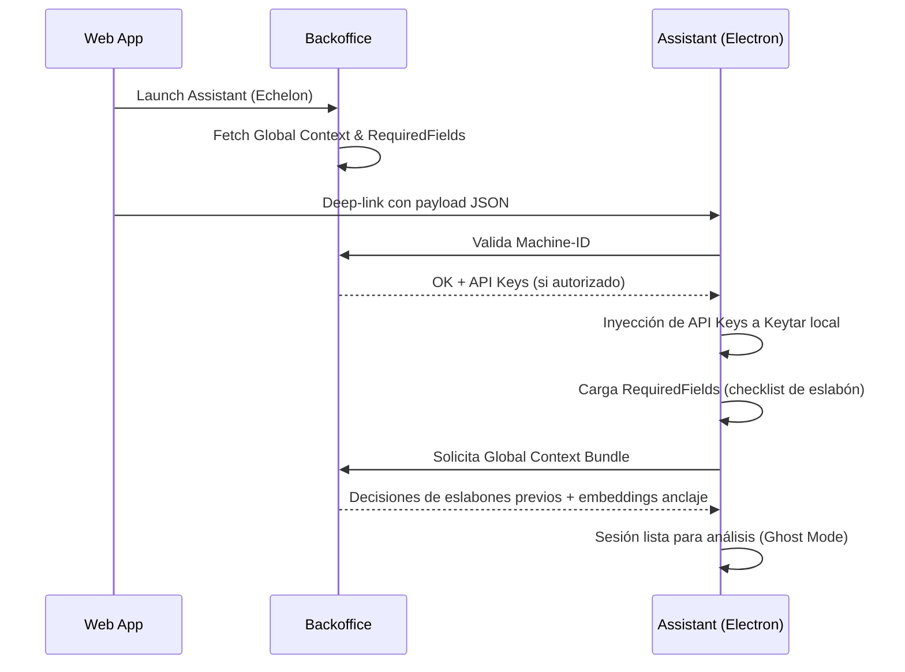
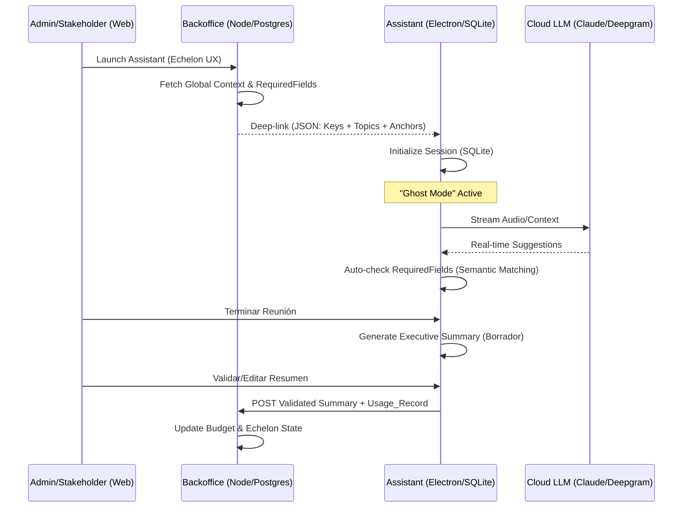

# Resumen Ejecutivo de Arquitectura: Project-Planning System

**Versión:** 5.1 · **Estado:** Consolidado · **Audiencia:** Técnica y ejecutiva  
**Fuentes:** `ARCHITECTURE.md`, `ASSISTANT_MODULE_CONTEXT.md`, `SESSION_CONTEXT_PLAN.md`, `AUDIO_PLAN.md` + debate de diseño.

El documento está organizado en **tres bloques**: (I) **Backoffice** (Control Plane), (II) **Assistant** (Data Plane / Agente Ghost) e (III) **Integración** entre ambos. Cada plataforma tiene sus diagramas, flujos, arquitectura y tecnologías identificables; el bloque de integración describe cómo se conectan y qué flujos cruzan las dos.

---

## Visión global y pilares

Project-Planning es una **plataforma de gobierno del ciclo de vida de producto (SDLC)**. El conocimiento técnico no debe perderse entre los distintos eslabones del proyecto; para ello se separa explícitamente el **Control Plane (nube)** —gobernanza, trazabilidad, presupuesto— y el **Data Plane (local)** —ejecución de alto rendimiento y privacidad.

| Pilar                    | Descripción                                                                                                    |
| ------------------------ | -------------------------------------------------------------------------------------------------------------- |
| **Modo Ghost**           | Captura invisible y protegida por hardware para que terceros en reunión no detecten al asistente.              |
| **Soberanía del dato**   | El audio crudo y los datos sensibles se procesan y almacenan en la máquina local del usuario.                  |
| **Eslabones (Echelons)** | Etapas de proyecto independientes (UX, PM, Dev) que consolidan múltiples reuniones en un cierre técnico único. |
| **Semantic Anchoring**   | Uso de IA para anclar decisiones de un eslabón anterior y evitar contradicciones en el eslabón actual.         |

---

# Parte I — Backoffice (Control Plane)

Responsabilidad: gobernanza empresarial, multi-tenencia, trazabilidad de decisiones (Semantic Anchoring), control de presupuesto y ciclo de vida del eslabón. El Backoffice no ejecuta análisis de audio ni pantalla; orquesta qué puede hacer el Assistant y consolida los resultados.

---

## I.1 Stack tecnológico (Backoffice)

| Capa                             | Tecnología                  | Uso                                                                                                                      |
| -------------------------------- | --------------------------- | ------------------------------------------------------------------------------------------------------------------------ |
| **Backend**                      | Node.js / Express           | API REST; orquestación de lanzamiento del Assistant y recepción de resúmenes y uso.                                      |
| **Base de datos**                | PostgreSQL                  | Metadatos, jerarquía Compañía → Productos → Eslabones, sesiones, resúmenes, RequiredFields, DECISION_LINK, USAGE_RECORD. |
| **Identidad**                    | Supabase (opcional)         | Gestión de identidades y RLS si se usa; alternativa: enrolamiento propio por Machine-ID + JWT.                           |
| **Identidad / dispositivos**     | Ghost Identity (Machine-ID) | Autorización de dispositivos; autenticación propia vía JWT; sin dependencia de Firebase.                                 |
| **Almacenamiento de documentos** | Amazon S3                   | Archivo final de documentos (PDF, CSV, Mermaid) una vez cerrado el eslabón.                                              |

---

## I.2 Arquitectura de componentes (Backoffice)

- **Web App / Admin:** Lanza el Assistant para un eslabón (UX/PM/Dev), recibe deep-link; más adelante valida/edita resúmenes vía Assistant o futuras pantallas web.
- **API:** Valida Machine-ID, devuelve Global Context + RequiredFields + embeddings de anclaje; recibe POST de resumen validado y usage; actualiza estado del eslabón y presupuesto.
- **PostgreSQL:** Fuente de verdad para compañías, productos, eslabones, sesiones, resúmenes, RequiredFields, DECISION_LINK, dispositivos y USAGE_RECORD.
- **S3:** Documentos finales (PDF, CSV, Mermaid) al cerrar el eslabón.

---

## I.3 ERD — Postgres (Backoffice)

Multi-tenencia, trazabilidad de decisiones (Semantic Anchoring) y control de presupuesto.

---

## I.4 Flujos internos (Backoffice)

| Flujo                         | Actores         | Descripción                                                                                                                                                                |
| ----------------------------- | --------------- | -------------------------------------------------------------------------------------------------------------------------------------------------------------------------- |
| **Launch Assistant**          | Web → API       | Admin elige eslabón (p. ej. UX); API prepara Global Context, RequiredFields y embeddings de decisiones ancladas; responde con payload para deep-link.                      |
| **Validar dispositivo**       | Assistant → API | Assistant envía Machine-ID; API comprueba dispositivo autorizado y devuelve API Keys (inyección segura) si aplica.                                                         |
| **Recibir resumen y uso**     | Assistant → API | POST con resumen validado + Usage_Record; API persiste EXECUTIVE_SUMMARY, ATTACHMENT, USAGE_RECORD; actualiza presupuesto y estado del eslabón (RequiredFields, state).    |
| **Ranked Retrieval (diseño)** | API (interno)   | Para no exceder contexto del LLM: en handshake o durante sesión, enviar solo fragmentos semánticamente relevantes al tópico detectado (no todos los resúmenes anteriores). |

---

## I.5 Triggers de integración (Integration Engine)

El Integration Engine no dispara acciones genéricas: los **productos de salida** dependen del **tipo de eslabón**. Al cerrar el eslabón (dueño da OK en CLOSURE_REVIEW → CLOSED), se ejecutan las integraciones configuradas para ese tipo.

| Tipo de eslabón          | Productos de salida / integraciones                                                                                                                                                                        |
| ------------------------ | ---------------------------------------------------------------------------------------------------------------------------------------------------------------------------------------------------------- |
| **Eslabón PM**           | Generación automática de los **tickets mínimos necesarios** en Jira, Trello o ClickUp a partir del resumen validado (acciones, responsables, criterios de aceptación extraídos del contenido consolidado). |
| **Eslabón Arquitectura** | Generación y **persistencia de activos técnicos**: documentos Mermaid (diagramas de secuencia, arquitectura), diagramas E.R., archivos CSV/PDF; almacenamiento en S3 y referencias en Postgres.            |
| **Eslabón UX / Dev**     | Definido por `config_blueprint` del eslabón; mismo patrón: salidas específicas por rol para diferenciar el valor entregado en cada cierre.                                                                 |

---

## I.6 Ciclo de vida del Eslabón (Backoffice / producto)

Lógica multi-reunión y consolidación final. El estado del eslabón vive en Postgres; las transiciones las disparan la Web/Admin y el Assistant (POST de resúmenes, acción “Consolidar Eslabón”, OK del dueño).

**Estados del documento (resumen de una sesión):** Borrador IA → Revisión → Editado → Validado.

**Consolidación final del eslabón (reporte global):** El resumen ejecutivo **global** del eslabón (el que consolida todas las reuniones) sigue un proceso explícito para evitar alucinaciones y permitir corrección humana:

1. **Generación por IA:** El reporte final se genera a partir **únicamente** de los resúmenes ya validados de cada sesión (no de audio o contenido crudo sin validar), reduciendo alucinaciones.
2. **Edición / revisión humana:** El dueño del eslabón debe poder **corregir este informe final** antes del cierre definitivo (estado "Editado" en la consolidación). Así se subsana error humano o matices sin perder el trabajo previo; solo tras esta revisión se considera listo para CLOSED y para disparar los triggers de integración (Jira, S3, etc.).

El sistema no cierra eslabones de forma automática: sugiere el cierre cuando RequiredFields están cubiertos y requiere que el dueño valide (y opcionalmente edite el reporte consolidado) para disparar integraciones.

---

# Parte II — Assistant (Data Plane / Agente Ghost)

Responsabilidad: ejecución en el dispositivo del usuario con baja latencia y soberanía del dato. Captura audio y pantalla, analiza con LLM (local y/o nube), genera sugerencias en tiempo real y, en integración con el Backoffice, recibe contexto inyectado y envía resúmenes validados y uso.

---

## II.1 Stack tecnológico (Assistant)

| Capa                    | Tecnología                                   | Uso                                                                          |
| ----------------------- | -------------------------------------------- | ---------------------------------------------------------------------------- |
| **Runtime**             | Electron (Main: Node.js, Renderer: Chromium) | Aplicación de escritorio; IPC entre renderer y main.                         |
| **Base de datos local** | SQLite (`better-sqlite3`, WAL mode)          | Transcripciones, sugerencias, caché L2, presupuesto local; latencia < 5 ms.  |
| **LLM local**           | Ollama                                       | Análisis y embeddings (`nomic-embed-text`); funcionamiento offline.          |
| **LLM nube**            | Claude Haiku 4.5, DeepSeek                   | Análisis de mayor calidad cuando presupuesto y red lo permiten.              |
| **STT**                 | Deepgram Nova-3                              | WebSocket en tiempo real, diarización; canal L = mic, R = sistema (Nivel 2). |
| **OCR**                 | Tesseract.js                                 | Inglés + español; capturas de pantalla.                                      |
| **Lenguaje**            | JavaScript (CommonJS)                        | Sin TypeScript en el código actual.                                          |
| **IPC**                 | ipcMain / ipcRenderer + preload              | Canal whitelist, ContextBridge.                                              |
| **UI**                  | Web Components (Lit)                         | AssistantPanel, AssistantSettings, AssistantBadge; sin React/Vue/Angular.    |

---

## II.2 Arquitectura de componentes (Assistant)

El módulo Assistant es independiente de Listen/Ask. Listen está en deprecación; las decisiones arquitectónicas aplican solo a Assistant.

---

## II.3 ERD — SQLite (Assistant)

Propósito: ejecución de baja latencia y almacenamiento temporal/operativo.

- **Contexto:** Transcripciones por speaker (Speaker_1/Speaker_2), capturas con OCR.
- **Caché L2:** Clave estable (Smart Cache Phase 3/4): hash por stage + topic/cluster + switches + language.
- **Sesión:** Configuración inyectada temporal (API keys, tópicos); estado de sesión en memoria (`_sessionContext`), no persistido en MVP.

---

## II.4 Flujos de datos (Assistant)

### II.4.1 Audio (Nivel 2 — estéreo + Deepgram multichannel)

- Frontend: un `ChannelMergerNode` (L = mic, R = sistema), un ScriptProcessor, un flujo IPC (`assistant:send-stereo-audio`).
- Deepgram recibe estéreo a 24 kHz; respuesta con `channel_index`. Backend asigna: `channel_index[0] === 1` → Speaker_2, si no Speaker_1.
- Windows: `getDisplayMedia` + `setDisplayMediaRequestHandler` (auto-selección silenciosa). macOS: canal de sistema pendiente (Parte II de `AUDIO_PLAN.md`).

### II.4.2 Análisis (ruta crítica)

1. `AssistantService`: bucle adaptativo (30–120 s según contexto).
2. `contextAggregator.getContext()`: audio últimos 5 min, últimas 3 capturas de pantalla.
3. Detección de cambio de contexto y tópico; anti-deadlock (force tras 3 skips o 5 min).
4. Actualización de `_sessionContext` (currentTopic, stage, topicClusterId); paso a `intelligenceEngine.analyze()`.
5. Caché L1 → L2; si miss: `providerRouter.selectProvider()` (presupuesto, forceCloud, prioridad de switch, context richness).
6. `_buildPrompt()` en 6 capas; llamada a Ollama o Cloud; parseo y enriquecimiento; Phase 1 + Phase 5 dedup; `suggestionManager.addSuggestions()`; evento `suggestions-updated`.

### II.4.3 Captura de pantalla y OCR

Captura (desktopCapturer / screencapture) → hash dHash (9×8) → detección de cambio (Hamming > 2) → OCR Tesseract (en+es) → detección de código por patrones. Últimas 3 capturas; ~60–70% de skips de OCR por ausencia de cambio significativo.

---

## II.5 Estados de sesión (reunión / coding) — Assistant

Detección de etapa de la conversación para adaptar sugerencias y reducir transiciones prematuras (`StageDetector`, Context Phase 2 + N-1).

- `exploring` — Presentación, descubrimiento del tema (inicial).
- `implementing` — Requisitos, diseño, implementación.
- `testing` — Pruebas, validación.
- `wrapping_up` — Cierres, próximos pasos.
- `unknown` — Fallback.

**Reglas (N-1):** Histéresis asimétrica (`STABLE_WINDOW_UP = 3`, `STABLE_WINDOW_DOWN = 3`), `MIN_CYCLES_IN_STAGE = 2`, `FAST_TRANSITION_GAP = 6`. Downward (→ `wrapping_up`) sin restricción adicional.

---

## II.6 Estrategia de IA (Assistant)

### II.6.1 Arquitectura de prompt en 6 capas

Separación entre señales de contexto (aditivas) y reglas de salida (solo switch dominante), para evitar contradicciones con varios switches activos.

| Capa                | Contenido                                                                                                                |
| ------------------- | ------------------------------------------------------------------------------------------------------------------------ |
| 1 — ROLE            | Identidad fija del sistema.                                                                                              |
| 2 — CONTEXT SIGNALS | Todos los switches activos aportan `contextSignal` (aditivo).                                                            |
| 3 — CONTEXT SOURCE  | Solo audio / solo pantalla / audio + pantalla.                                                                           |
| 4 — OUTPUT RULES    | Solo el switch **dominante**. Precedencia: exercise > coding > debug > system-design > tech-debate > research > meeting. |
| 5 — CONTEXT DATA    | Audio y OCR sanitizados (`_sanitizeContext`) + etapa y tópico de sesión.                                                 |
| 6 — RESPONSE SCHEMA | Formato JSON estricto.                                                                                                   |

**Sanitización:** Eliminación de bloques de código, secuencias de escape, frases de inyección, tokens de rol (SYSTEM:, ASSISTANT:, USER:) y espacios redundantes antes de interpolación en el prompt.

### II.6.2 Smart Cache (Phases 2–5)

| Fase    | Clave / comportamiento                                                                     | Hit rate / efecto          |
| ------- | ------------------------------------------------------------------------------------------ | -------------------------- |
| Phase 2 | Raw: `SHA-256(audio + screen + switches + language)`                                       | 0% con audio acumulativo.  |
| Phase 3 | `stage + normalizedTopic` (top-3 keywords ordenados) + switches + language                 | ~10%.                      |
| Phase 4 | `stage + topicClusterId` (TopicEmbeddingClusterer, nomic-embed-text, coseno ≥ 0,82)        | Objetivo ~40–60%.          |
| Phase 5 | Dedup semántico: embeddings título+descripción, coseno ≥ 0,88; sync (Jaccard, MD5) primero | Catch rate ~10% → ~35–50%. |

L1: memoria, 10 entradas, TTL 5 min, LRU. L2: SQLite, 50 entradas, TTL 30 min. Fallback de clave: `topicClusterId` → `normalizedTopic` → raw.

### II.6.3 Límites de salida por switch (N-2)

`maxOutputTokens` dinámico por switch (el más restrictivo activo gana). Valores calibrados: debug 800, exercise/coding 5000, meeting 600, research 1400, system-design/tech-debate/default 5500. Aplicado a Ollama y Cloud.

---

## II.7 Patrones de diseño (Assistant)

| Patrón            | Dónde                                             | Propósito                                   |
| ----------------- | ------------------------------------------------- | ------------------------------------------- |
| Singleton         | Servicios y repositorios                          | Una instancia por proceso.                  |
| EventEmitter      | AssistantService, SuggestionManager, AudioCapture | Desacoplamiento pub/sub.                    |
| State Machine     | AudioStateMachine                                 | Transiciones válidas del pipeline de audio. |
| Dual-Layer Cache  | L1 (Map) + L2 (SQLite)                            | Evitar llamadas LLM redundantes.            |
| Shared Connection | sqliteClient.getDb()                              | Una única conexión SQLite.                  |
| Adaptive Timing   | Bucle de análisis en AssistantService             | Intervalos según criticidad del contexto.   |

---

## II.8 Restricciones y seguridad (Assistant)

- **Presupuesto local:** ~20 USD/mes en APIs en la nube; límite duro; fallback a Ollama al agotar.
- **Latencia:** Análisis < 15 s.
- **Memoria:** Sin fugas; caché acotado.
- **Base de datos:** Singleton `sqliteClient`; no nuevas conexiones.
- **Compatibilidad:** Switches, prompts y UI actuales; tests existentes deben seguir pasando.
- **Offline:** Funcionamiento con Ollama sin red.
- **Privacidad:** Audio y pantalla en SQLite local; solo prompts al LLM salen a la nube (no audio crudo).
- **IPC:** Whitelist de canales, ContextBridge, sin `eval()`, entradas validadas.
- **Idioma:** Español como principal para sugerencias.

---

# Parte III — Integración (Backoffice ↔ Assistant)

Describe cómo se conectan las dos plataformas: handshake, inyección de contexto, ciclo de vida de una sesión end-to-end, Semantic Anchoring (que cruza ambas) y riesgos de integración con mitigaciones.

---

## III.1 Secuencia: Handshake e inyección (Launch & Inject)

Comunicación entre Web App, Backoffice y Assistant para un arranque controlado y seguro.

### UX del enrolamiento (primera vez)

Para claridad del equipo de desarrollo: el enrolamiento por Machine-ID se concreta así:

- **Primera ejecución:** Al iniciar por primera vez, el Assistant abre una **ventana de login** que apunta al Backoffice web (URL del Backoffice; el usuario inicia sesión en el navegador).
- **Vinculación del dispositivo:** Tras el login exitoso, el Backoffice (o el Assistant con token de sesión) realiza un **POST de vinculación** con payload `{ machineId, userId, osInfo }` al API. El Backoffice registra el dispositivo como autorizado para ese usuario.
- **Efecto:** En arranques posteriores no es necesario cargar credenciales manualmente; la validación por Machine-ID basta para inyección de API Keys y contexto (si el dispositivo sigue autorizado).

---

## III.2 Secuencia: Ciclo de vida de una sesión (E2E)

Flujo completo desde el lanzamiento en la web hasta la persistencia en el Backoffice.

---

## III.3 Semantic Anchoring (integración)

Permite que un eslabón cite decisiones de otro sin redundancia y que se detecten contradicciones. Involucra Backoffice (matriz, inyección) y Assistant (detección local).

| Componente                     | Plataforma              | Descripción                                                                                                                                                                                                                                                   |
| ------------------------------ | ----------------------- | ------------------------------------------------------------------------------------------------------------------------------------------------------------------------------------------------------------------------------------------------------------- |
| **1. Matriz de trazabilidad**  | Backoffice (Postgres)   | Tabla `DECISION_LINK` mapea dependencias entre eslabones (p. ej. "Definición de API" en Dev depende de "Esquema de Datos" en Arquitectura).                                                                                                                   |
| **2. Inyección de anclaje**    | Integración (Handshake) | Al iniciar el Assistant, el Backoffice envía los embeddings semánticos de las decisiones ya validadas (no solo texto).                                                                                                                                        |
| **3. Detección de conflictos** | Assistant (local)       | El Assistant usa `nomic-embed-text` para comparar el audio actual con los embeddings anclados. Si la similitud de coseno indica contradicción (p. ej. cambiar un deadline ya validado), se dispara la alerta "Conflicto de Decisión" en el panel de contexto. |

### Visibilidad de tópicos heredados en el panel Context (Assistant)

En el **panel de Context** del Assistant el usuario no solo ve los tópicos de la sesión actual; esta información es **consultable en tiempo real durante la reunión**:

- **Tópicos propios del eslabón:** Los RequiredFields y el progreso de la sesión actual.
- **Tópicos cerrados por otros eslabones:** Cuáles decisiones ya fueron validadas en eslabones anteriores (UX, PM, Arquitectura, etc.), para evitar duplicar o contradecir.
- **Tópicos bloqueados por dependencias externas:** Cuáles RequiredFields dependen de decisiones aún no cerradas en otro eslabón (vía DECISION_LINK), de modo que el usuario entienda por qué cierto ítem está "bloqueado" hasta que otro eslabón cierre su parte.

El Backoffice incluye en el Global Context Bundle (y el Assistant lo expone en el panel) esta información para que Semantic Anchoring sea visible y accionable durante la reunión, no solo en background.

---

## III.4 Documentos: referenciados vs almacenados

Los documentos (PDF, CSV, Mermaid) que el Backoffice almacena en S3 y que el eslabón referencia no son solo un depósito final: el **Assistant debe consumir siempre la última versión** del documento cargado en el Backoffice para que las decisiones se tomen sobre la información más reciente.

- **Referenciado:** El Assistant no almacena el archivo completo como fuente de verdad; obtiene la versión actual desde el Backoffice (o desde una caché local invalidable).
- **Indexación local:** El Assistant indexa localmente el contenido vía **embeddings** (p. ej. nomic-embed-text) para búsqueda semántica y detección de conflictos sin enviar el documento entero al LLM en cada llamada.
- **Principio:** Cualquier decisión o sugerencia que dependa de un documento (esquema, especificación, diagrama) debe basarse en la **última versión** disponible en el Backoffice; si el documento se actualiza en el Backoffice, el Assistant debe poder refrescar la indexación local (y invalidar checks semánticos asociados hasta que la nueva versión esté sincronizada, según la mitigación en III.6).

---

## III.5 Trade-offs que cruzan Backoffice y Assistant

| Área                  | Decisión                                                                                      | Contrapartida                                                             |
| --------------------- | --------------------------------------------------------------------------------------------- | ------------------------------------------------------------------------- |
| **Hardware vs. nube** | Prioridad a velocidad y calidad con APIs en la nube; embeddings y contexto pesado en local.   | Se sacrifica autonomía total (Ollama como único recurso).                 |
| **Validación humana** | No hay cierre automático de eslabones; el dueño debe validar para disparar integraciones.     | Mayor fricción operativa a cambio de control y trazabilidad.              |
| **Seguridad de keys** | Las API Keys se inyectan desde el Backoffice y se almacenan cifradas en el dispositivo local. | Riesgo limitado a la máquina del usuario; no hay exfiltración por diseño. |

---

## III.6 Análisis de fallos potenciales (integración) — auditoría senior

Riesgos estructurales en la frontera entre Backoffice y Assistant y mitigaciones acordadas.

| Fallo potencial                     | Descripción                                                                                                                                                                 | Mitigación                                                                                                                                       |
| ----------------------------------- | --------------------------------------------------------------------------------------------------------------------------------------------------------------------------- | ------------------------------------------------------------------------------------------------------------------------------------------------ |
| **Race condition en consolidación** | Dos usuarios validan resúmenes de reuniones distintas del mismo eslabón de forma simultánea; el estado de RequiredFields puede entrar en conflicto.                         | Bloqueos optimistas en Postgres basados en `version_id` del eslabón.                                                                             |
| **Crecimiento del contexto**        | Inyectar todos los resúmenes anteriores en el prompt de la nueva reunión puede exceder los `maxOutputTokens` calibrados.                                                    | El Backoffice debe realizar **Ranked Retrieval** y enviar solo fragmentos semánticamente relevantes al tópico detectado en los primeros minutos. |
| **Sincronización de archivos**      | Los archivos PDF/CSV cargados localmente deben garantizar integridad; si el usuario edita localmente, el check semántico puede quedar desalineado hasta sincronizar con S3. | Hash de integridad en archivos; invalidar el check semántico asociado hasta que la nueva versión se sincronice con S3.                           |

---

# Transversal

## Herramientas para visualización de diagramas

- **Mermaid Live Editor** (navegador).
- **Obsidian** (soporte nativo Mermaid).
- **Plugins de IDE:** p. ej. “Mermaid Preview” en VS Code o IntelliJ.
- **Notion:** bloques de código Mermaid con previsualización.

---

## Nota de auditoría

Las decisiones reflejadas en este resumen han sido validadas contra la documentación técnica del repositorio y contra el debate de diseño que consolidó la visión de Project-Planning. En la versión 5.1 se incorporan: (1) especificidad de los triggers de integración por tipo de eslabón (PM: Jira/Trello/ClickUp; Arquitectura: Mermaid, E.R., CSV/PDF); (2) estado "Editado" y flujo de consolidación final del eslabón (generación por IA desde resúmenes validados, revisión humana antes de CLOSED); (3) UX del enrolamiento (ventana de login inicial, POST de vinculación `{ machineId, userId, osInfo }`); (4) visibilidad en tiempo real en el panel Context de tópicos heredados, cerrados por otros eslabones y bloqueados por dependencias; (5) documentos referenciados vs almacenados (consumo de última versión desde Backoffice, indexación local vía embeddings). La estructura en tres bloques (Backoffice, Assistant, Integración) se mantiene. Los objetivos de latencia (<15 s) y de coste operativo dentro de presupuestos enterprise siguen como criterios de aceptación.
